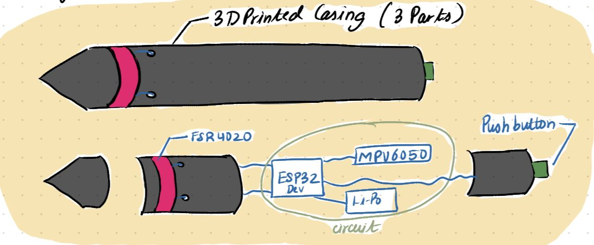
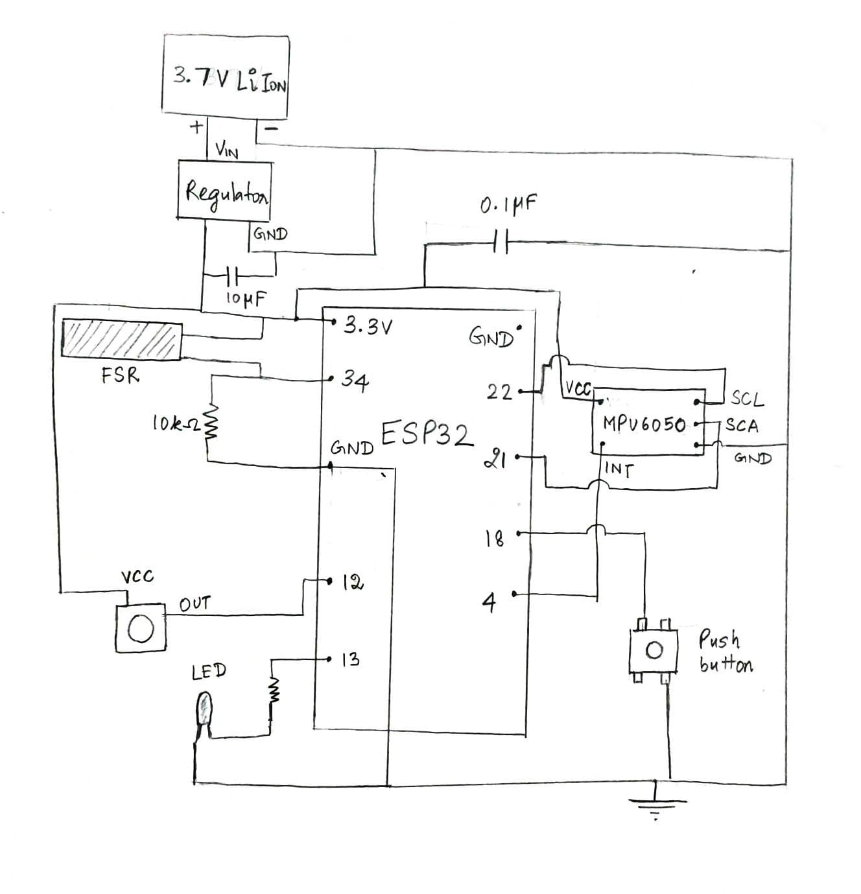
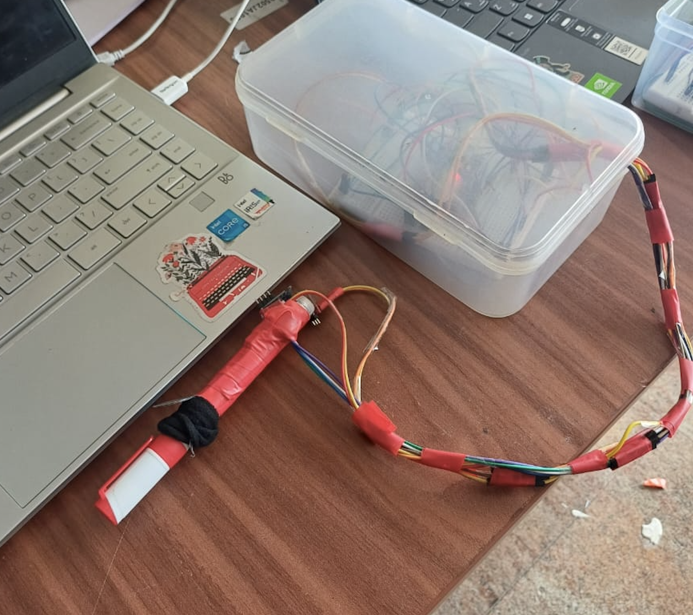
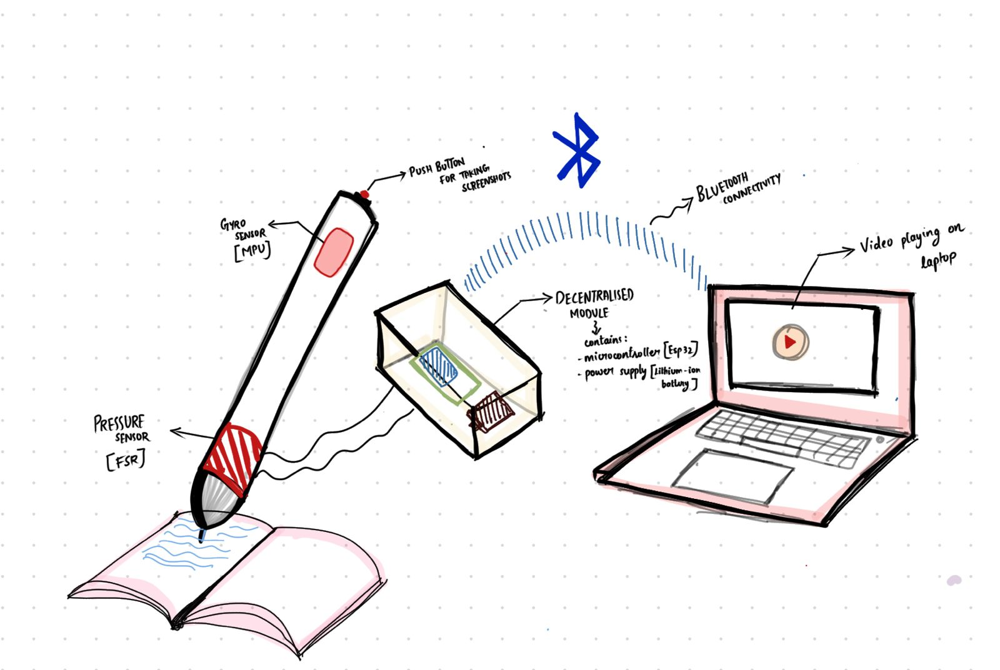
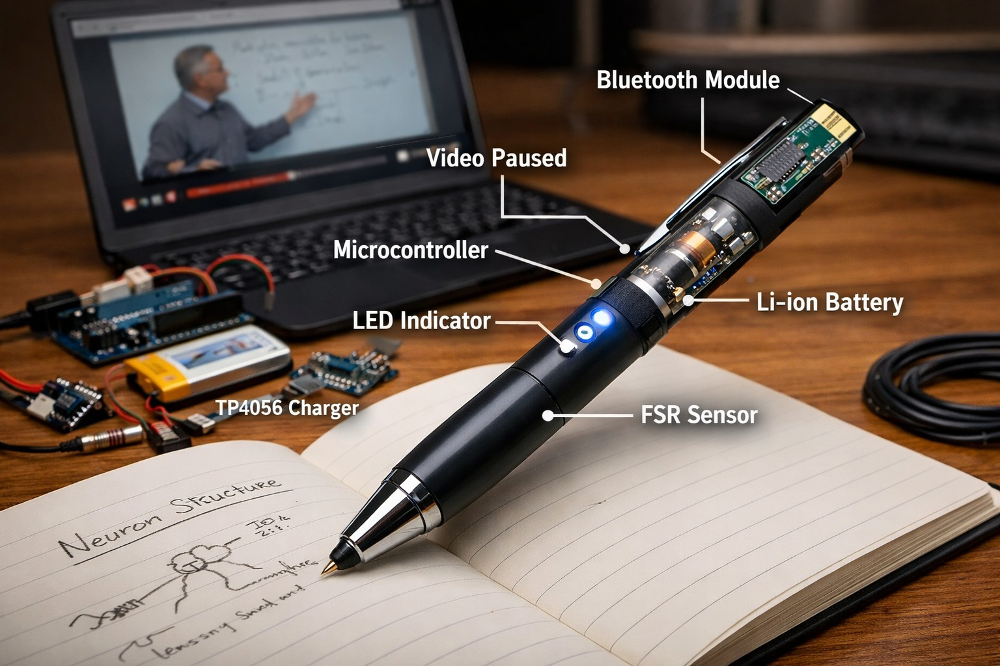

<h2 align="center">Smart Writing Aid</h2>

  A hands-free media controller embedded in a pen — automatically pauses and resumes video lectures
  based on writing activity, with gesture-based skip and one-tap screenshot capture.

<h3>🧠 Problem Statement</h3>

Students and professionals who learn through video lectures face constant interruptions while taking notes.
Pausing, rewinding, and resuming videos manually breaks concentration, reduces learning efficiency,
and increases the time required to understand content.
The Smart Writing Aid solves this by automatically pausing the video when the user starts writing
and resuming it when they stop — no keyboard or mouse needed.

<h3>⚙️ How It Works</h3>
<ol>
  <li>User begins writing → FSR detects grip pressure → ESP32 reads analog value from pin 34</li>
  <li>Value crosses threshold → ESP32 sends <code>PAUSE</code> over serial → Python script presses spacebar</li>
  <li>User stops writing → pressure drops → ESP32 sends <code>PLAY</code> → video resumes</li>
  <li>User flicks pen forward → MPU6050 detects acceleration spike → <code>FORWARD</code> → right arrow key</li>
  <li>User taps touch sensor → ESP32 sends <code>SHOT</code> → Python triggers Cmd+Shift+3 screenshot</li>
</ol>

  

<i>Initial concept sketch</i>

<h3>🔧 Hardware Components</h3>

<table align="center">
  <tr>
    <th>Component</th>
    <th>Qty</th>
    <th>Purpose</th>
    <th>Cost (₹)</th>
  </tr>
  <tr><td>FSR Thin Film Pressure Sensor</td><td>1</td><td>Detect writing pressure at pen grip</td><td>400</td></tr>
  <tr><td>ESP32 Dev Module</td><td>1</td><td>Microcontroller — reads sensors, sends signals</td><td>378</td></tr>
  <tr><td>MPU6050 IMU</td><td>1</td><td>Accelerometer for gesture detection (forward skip)</td><td>172</td></tr>
  <tr><td>Resistor (10 kΩ)</td><td>1</td><td>Voltage divider for FSR</td><td>11</td></tr>
  <tr><td>Resistor (220 Ω)</td><td>1</td><td>Current limiting for LED</td><td>—</td></tr>
  <tr><td>LED</td><td>1</td><td>Writing state indicator</td><td>14</td></tr>
  <tr><td>Li-Po Battery (3.7V 360mAh)</td><td>1</td><td>Power supply</td><td>306</td></tr>
  <tr><td>TP4056 Charging Module</td><td>1</td><td>Battery charging</td><td>45</td></tr>
  <tr><td>Voltage Regulator / Capacitors</td><td>1</td><td>Stable 3.3V supply</td><td>114</td></tr>
  <tr><td><b>Total</b></td><td></td><td></td><td><b>~₹1,440</b></td></tr>
</table>

<h3>🔌 Circuit Connections</h3>

<h4>FSR + LED (Writing Detection)</h4>
<pre><code>ESP32 3.3V  →  FSR pin 1
FSR pin 2   →  ESP32 GPIO 34  (analog input)
10kΩ        →  GPIO 34 and GND  (pull-down voltage divider)
220Ω        →  ESP32 GPIO 25
220Ω        →  LED anode (long leg)
LED cathode (short leg)  →  GND

Press FSR → pressure increases → higher analog value at pin 34
→ value crosses threshold → LED ON, sends PAUSE
Release FSR → value drops → LED OFF, sends PLAY
</code></pre>

<h4>MPU6050 (Gesture — Forward Skip)</h4>
<pre><code>MPU6050 VCC  →  ESP32 3.3V
MPU6050 GND  →  ESP32 GND
MPU6050 SCL  →  ESP32 GPIO 22
MPU6050 SDA  →  ESP32 GPIO 21
MPU6050 INT  →  ESP32 GPIO 18  (optional)

Wire.begin(SDA=14, SCL=27) used in code — adjust to your wiring.
Flick pen forward → ax delta exceeds motionThreshold (8000) → sends FORWARD
</code></pre>

<h4>Touch Sensor (Screenshot)</h4>
<pre><code>Touch sensor OUT  →  ESP32 GPIO 2
Touch sensor VCC  →  3.3V
Touch sensor GND  →  GND

Tap button → GPIO 2 reads HIGH → sends SHOT
</code></pre>

  

<i>Circuit diagram</i>

<h3>🗂️ Repository Structure</h3>
<pre><code>smart-writing-aid/
├── arduino_controller.ino   ← ESP32 firmware (FSR + MPU6050 + touch sensor)
├── mpu.py                   ← Python script (serial listener → keyboard control)
├── assets/
│   ├── circuit.jpeg
│   ├── sketch.jpeg
│   ├── initial_idea.jpeg
│   ├── future.jpeg
│   ├── photo.png            ← prototype photo
│   └── video.mp4            ← demo video
└── README.md
</code></pre>

<h3>▶️ How to Run</h3>

<h4>1. Flash the Arduino code</h4>
<pre><code>Open arduino_controller.ino in Arduino IDE
Select board: ESP32 Dev Module
Upload to your ESP32
</code></pre>

<h4>2. Install Python dependencies</h4>
<pre><code>pip install pyserial pyautogui
</code></pre>

<h4>3. Update serial port</h4>

In <code>mpu.py</code>, update the port to match your system:

<pre><code># macOS
ser = serial.Serial('/dev/cu.usbserial-XXXX', 115200, timeout=1)

# Windows
ser = serial.Serial('COM3', 115200, timeout=1)
</code></pre>

<h4>4. Run the Python script</h4>
<pre><code>python mpu.py
</code></pre>

Open a video, start writing — the pen takes over from there.

<h3>📸 Prototype</h3>

  

<i>Prototype — assembled hardware</i>

  

<i>Hardware sketch</i>

  

<i>Future vision — fully miniaturised pen with 3D printed casing</i>

<h4>📹 Demo Video</h4>

  A working demo of the Smart Writing Aid is available in <code>assets/video.mp4</code>. 
  <i>(Download or clone the repo to view — GitHub does not preview mp4 files inline.)</i>

<h3>🚀 Features</h3>
<ul>
  <li>✅ Auto pause/resume based on writing pressure (FSR)</li>
  <li>✅ Forward skip via pen flick gesture (MPU6050)</li>
  <li>✅ One-tap screenshot (touch sensor → Cmd+Shift+3)</li>
  <li>✅ LED writing-state indicator</li>
  <li>✅ Cooldown-based debouncing for stable gesture detection</li>
  <li>✅ Works with any video player (keyboard emulation)</li>
</ul>

<h3>🔮 Future Work</h3>
<ul>
  <li>Fully miniaturised all-in-pen architecture with custom PCB</li>
  <li>Wireless Wi-Fi / BLE communication (no USB cable)</li>
  <li>Gesture-based rewind, volume control (up/down motion)</li>
  <li>Browser extension for direct video platform integration</li>
  <li>Session analytics — writing time vs watching time, focus score</li>
  <li>Adaptive playback (slow down instead of fully pausing)</li>
</ul>

<h3>🛠️ Tools & Technologies</h3>
<ul>
  <li>ESP32 (Arduino framework), C++</li>
  <li>Python — pyserial, pyautogui</li>
  <li>MPU6050 (I2C), FSR, capacitive touch sensor</li>
  <li>macOS keyboard emulation (Cmd+Shift+3 for screenshots)</li>
</ul>

<h3>📄 References</h3>
<ol>
  <li>Arduino Documentation — <a href="https://www.arduino.cc">https://www.arduino.cc</a></li>
  <li>Interlink Electronics — Force Sensitive Resistor Integration Guide</li>
  <li>Espressif Systems — ESP32 Technical Reference Manual — <a href="https://www.espressif.com">https://www.espressif.com</a></li>
  <li>Wokwi Microcontroller Simulation Platform — <a href="https://wokwi.com">https://wokwi.com</a></li>
</ol>
